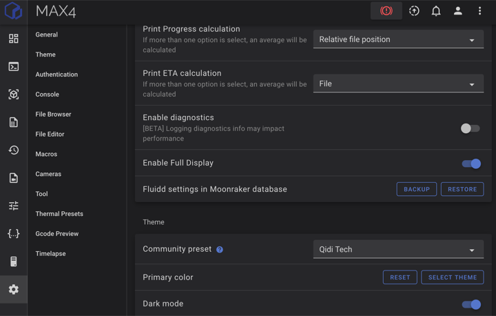
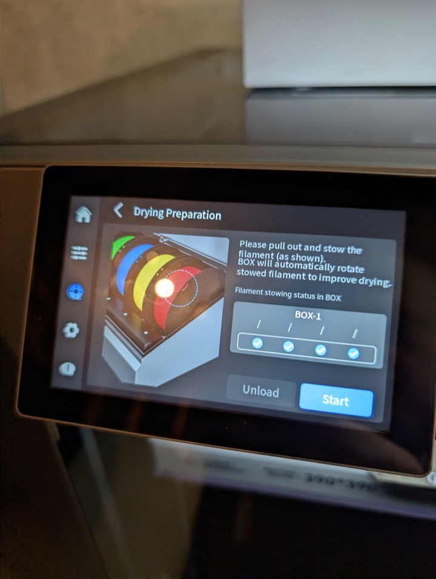

# FAQ
- [Does the Max 4 toolhead hit a wall when moving away from the waste chute like the Q2?](#max4-toolhead-wall-hit-q2)
- [How do I get root access?](#how-do-i-get-root-access)
- [Is the chamber mostly air tight?](#is-the-chamber-mostly-air-tight)
- [How do I keep the polar cooler tube from rubbing the glass?](#how-do-i-keep-the-polar-cooler-tube-from-rubbing-the-glass)
- [I saw the Max 4 has closed-loop X/Y motors, can it recover from step loss?](#max4-closed-loop-step-loss)
- [Where can I find stock/vanilla Klipper configs after I messed with them?](#stock-klipper-configs)
- [Why are OTA updates not working on my new Max 4?](#new-max4-ota-updates)
- [Why is my bed skirt warping?](#bed-skirt-warping)
- [Why don't I see my bed mesh in Fluidd?](#enable-fluidd-bed-mesh)
- [Can I use the Qidi Box's drying function while printing?](#qidi-box-drying-while-printing)
- [How do I control the fans via the console or gcode? What are all the fan addresses?](#fan-control-console-gcode)
- [How do I turn the polar cooler on and off via the console or gcode?](#polar-cooler-console-gcode)

## Does the Max 4 toolhead hit a wall when moving away from the waste chute like the Q2?

No, the design of the printer avoids this entirely.

## How do I get root access?

See [this page](./ssh_os.md#root-access).

## Is the chamber mostly air tight?

No. See [this page](./faq/chamber_air_leaks.md) for more information.

## How do I keep the polar cooler tube from rubbing the glass?

You can use the included cable ties wrapped around the highest points on the tube as Qidi instructs, or [see this](./mods/polar_cooler_things.md#tubing-rubs-on-glass).

## I saw the Max 4 has closed-loop X/Y motors, can it recover from step loss?

`FOC closed-loop` on the Max 4 appears to mean feedback-based X/Y motor control for smoother, quieter, and more stable motion. The current evidence does not show printer-level detection and recovery from XY position loss such as skipped steps, belt slip, or collisions. See [this page](./faq/max4_closed_loop_step_loss.md) for more information.

## Why are OTA updates not working on my new Max 4?

See [this page](./faq/initial_offline_firmware_update.md).

## Why is my bed skirt warping?

See [this page](./faq/bed_skirt_warping.md).

## Why don't I see my bed mesh in Fluidd?

You need to check "Enable Full Display" in your Fluidd settings.

## I've messed with my Klipper configs and now I want to go back to stock, how do I do this?

You can reference the stock configurations at [this repository](https://github.com/thelegendtubaguy/Qidi-Max4-Defaults)

## Can I use the Qidi Box's drying function while printing?

You can use the Qidi Box's heater, but do **not** use the drying function while printing.  The printer explicitly states that the filament must be unloaded prior to using the drying functiion as it will rotate the spools.

## How do I control the fans via the console or gcode? What are all the fan addresses?

See [this page](./fan_assignments.md).

## How do I turn the polar cooler on and off via the console or gcode?

See [this page](./fan_assignments.md).
