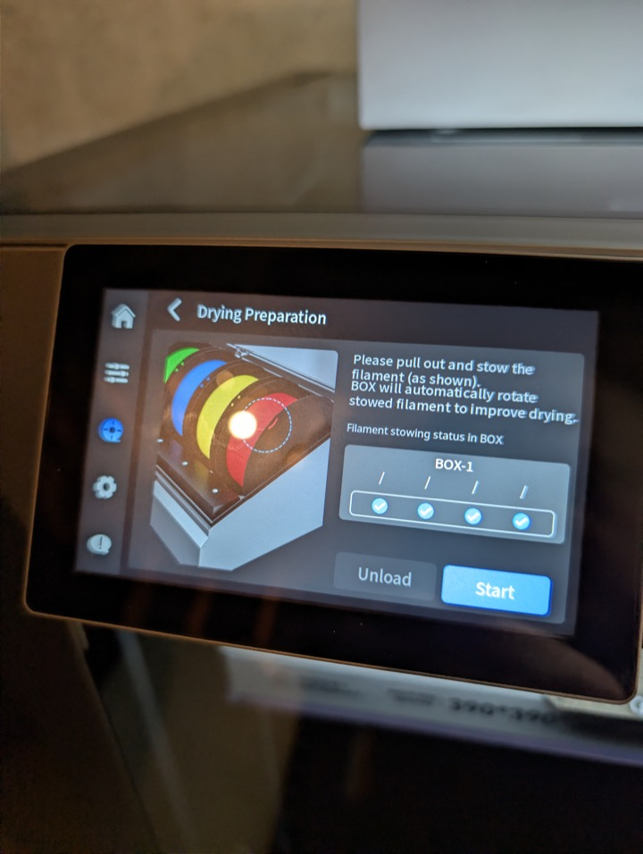
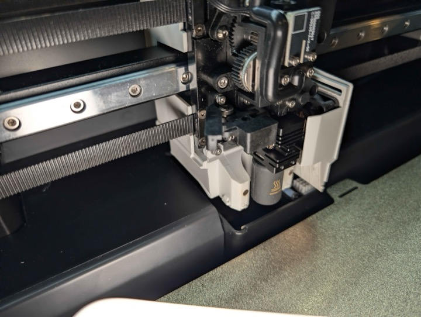
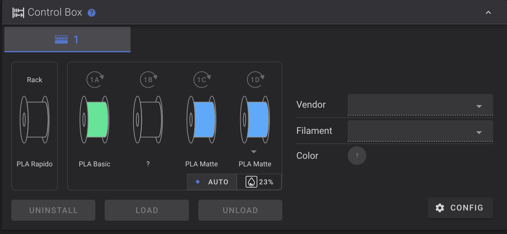
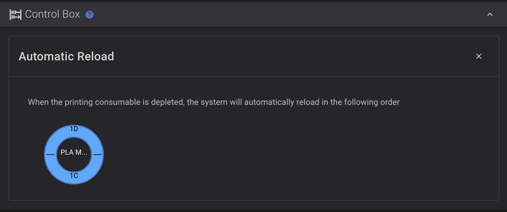
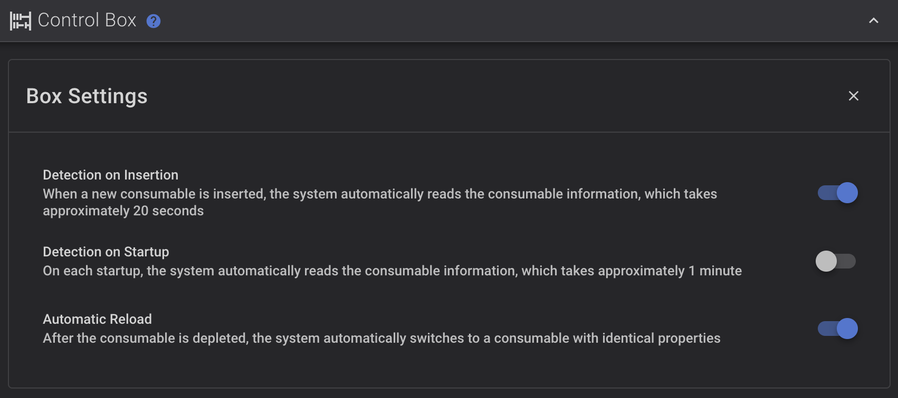
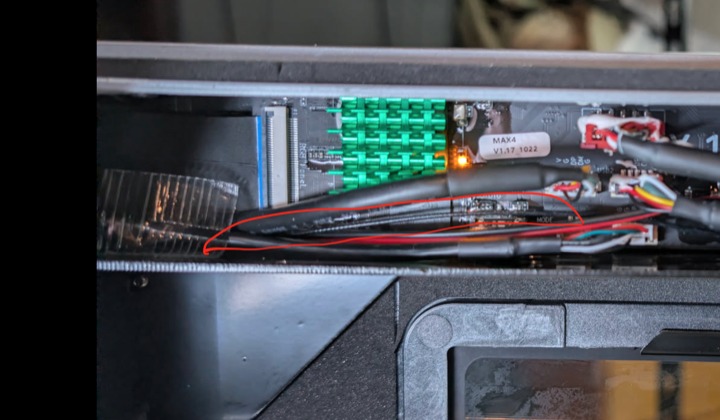
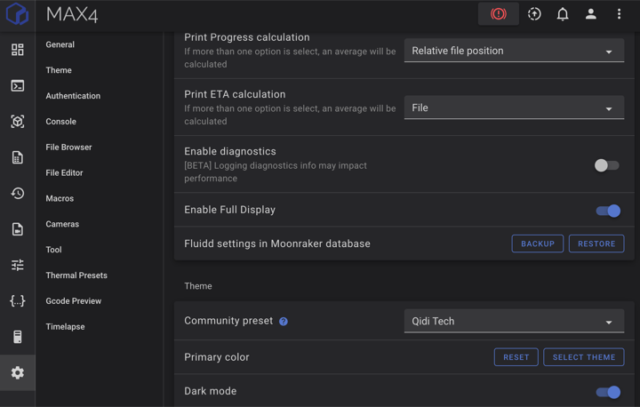

# FAQ
- [Can I use the Qidi Box's drying function while printing?](#qidi-box-drying-while-printing)
- [Does the Max 4 toolhead hit a wall when moving away from the waste chute like the Q2?](#max4-toolhead-wall-hit-q2)
- [How can I make sure that spool runout with the Qidi Box will do what I want?](#qidi-box-spool-runout-behavior)
- [How do I control the fans via the console or gcode? What are all the fan addresses?](#fan-control-console-gcode)
- [Can I control the RGB light under the heated bed?](#rgb-light-under-heated-bed)
- [How do I adjust the belts on the Max 4?](#how-do-i-adjust-the-belts-on-the-max-4)
- [How do I adjust the heat bed corner screws?](#how-do-i-adjust-the-heat-bed-corner-screws)
- [How do I get root access?](#how-do-i-get-root-access)
- [How do I keep the polar cooler tube from rubbing the glass?](#how-do-i-keep-the-polar-cooler-tube-from-rubbing-the-glass)
- [How do I remove the output PTFE tube from the box hub?](#remove-output-ptfe-tube-box-hub)
- [How do I set a Z offset?](#how-do-i-set-a-z-offset)
- [How do I turn the polar cooler on and off via the console or gcode?](#polar-cooler-console-gcode)
- [I saw the Max 4 has closed-loop X/Y motors, can it recover from step loss?](#max4-closed-loop-step-loss)
- [Is the chamber mostly air tight?](#is-the-chamber-mostly-air-tight)
- [Is the Qidi Box hub that comes with the Max 4 the same as the Q2 and/or Plus 4?](#max4-qidi-box-hub-same-q2-plus4)
- [Is there a way to reduce CPU usage?](#reduce-cpu-usage)
- [Where can I download the original models that Qidi shipped with the machine?](#download-original-models)
- [Where can I find stock/vanilla Klipper configs after I messed with them?](#stock-klipper-configs)
- [Where is the WiFi antenna located?](#wifi-antenna-location)
- [Why is the printer not respecting my DHCP DNS settings?](#dhcp-dns-settings)
- [Why are OTA updates not working on my new Max 4?](#new-max4-ota-updates)
- [Why don't I see my bed mesh in Fluidd?](#enable-fluidd-bed-mesh)
- [Why is my bed skirt warping?](#bed-skirt-warping)

## Can I use the Qidi Box's drying function while printing?

You can use the Qidi Box's heater, but do **not** use the drying function while printing.  The printer explicitly states that the filament must be unloaded prior to using the drying functiion as it will rotate the spools.

## Does the Max 4 toolhead hit a wall when moving away from the waste chute like the Q2?

No, the design of the printer avoids this entirely.

## How can I make sure that spool runout with the Qidi Box will do what I want?

In Fluidd, open `Control Box`. Click `AUTO` on the active spool to see the automatic reload cycle that will run after spool runout. Click `CONFIG` to turn `Automatic Reload` on or off.

## How do I control the fans via the console or gcode? What are all the fan addresses?

See [this page](./fan_assignments.md).

## Can I control the RGB light under the heated bed?

Yes. See [NeoPixel Control](./neopixel_control.md).

## How do I adjust the belts on the Max 4?

The Max 4 uses auto tensioners. See [this page](https://wiki.qidi3d.com/en/Max4/Adjustment-belt).

## How do I adjust the heat bed corner screws?

See [this page](./heated_bed_screws.md).

## How do I get root access?

See [this page](./ssh_os.md#root-access).

## How do I keep the polar cooler tube from rubbing the glass?

You can use the included cable ties wrapped around the highest points on the tube as Qidi instructs, or [see the tube routing section here](./polar_cooler.md#tubing-rubs-on-glass).

## How do I remove the output PTFE tube from the box hub?

See [this page](./max_4_qidi_box_hub.md#why-is-it-hell-to-get-the-output-ptfe-tube-disconencted).

## How do I set a Z offset?

See [our page about Z offset](./faq/z_offset.md).

## How do I turn the polar cooler on and off via the console or gcode?

See [the polar cooler control section](./polar_cooler.md#console-and-gcode-control).

## I saw the Max 4 has closed-loop X/Y motors, can it recover from step loss?

`FOC closed-loop` on the Max 4 appears to mean feedback-based X/Y motor control for smoother, quieter, and more stable motion. The current evidence does not show printer-level detection and recovery from XY position loss such as skipped steps, belt slip, or collisions. See [this page](./faq/max4_closed_loop_step_loss.md) for more information.

## Is the chamber mostly air tight?

No. See [this page](./faq/chamber_air_leaks.md) for more information.

## Is the Qidi Box hub that comes with the Max 4 the same as the Q2 and/or Plus 4?

No, it is not. A LOT of people are under the impression it's the same as the Q2.  It is not.  See [this page](./max_4_qidi_box_hub.md).

## Is there a way to reduce CPU usage?

Yes, there are two easy ways to reduce CPU usage. See [process hardening and optimizations](./mods/process_hardening_optimiztion.md#optimizations).

## Where can I download the original models that Qidi shipped with the machine?

You can download them [here](https://drive.google.com/file/d/1bM73t7GBGKObBbPRcIpSM3DMn7CrRfbv/view?usp=sharing).

## Where can I find stock/vanilla Klipper configs after I messed with them?

You can reference the stock configurations at [this repository](https://github.com/thelegendtubaguy/Qidi-Max4-Defaults)

## Where is the WiFi antenna located?

It comes off the AP board in the top left of the printer and goes toward the front.  It's the small black wire circled in red below.

## Why is the printer not respecting my DHCP DNS settings?

See [DNS Resolution](./mods/process_hardening_optimiztion.md#dns-resolution) in the process hardening doc.

## Why are OTA updates not working on my new Max 4?

See [this page](./faq/initial_offline_firmware_update.md).

## Why don't I see my bed mesh in Fluidd?

You need to check "Enable Full Display" in your Fluidd settings.

## Why is my bed skirt warping?

See [this page](./faq/bed_skirt_warping.md).
