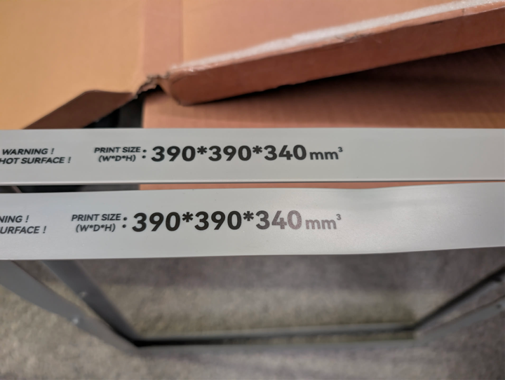

# Bed Skirt Warping

Qidi claims the original bed skirt should be good to 120C, however people have been experiencing the skirt around the bed warping at temps anywhere from 100-120C.  This isn't necessarily just a cosmetic issue as the bed skirt acts as the PEI sheet alignment guide and in one case was so severely warped/twisted it interfered with the bed mesh.

If yours is warping and causing you problems, reach out to `max4support@qidi3d.com`.  Qidi claims the new bed skirt has higher heat resistance up to 140C while remaining flame retardant.  The new skirt is made of a less shiny material and feels slightly scratchy (hard to show in a picture, but new is on top).

## Skirt Replacement Installation

> [!WARNING]
> This is a laborious process. If yours is not causing issues, really think about whether you want to replace it.

In order to replace the bed skirt, you will need to disconnect the heated bed and status LED light cabling at the back of the machine because the wires pass through the middle of the bed skirt. Remove the heated bed by undoing the four nuts in the corners underneath the bed. The skirt is attached using screws from the top of the bed around all edges.

See the [internals page](../internals.md#relay-switching-board-ssr) for where the heated bed connections are at.
