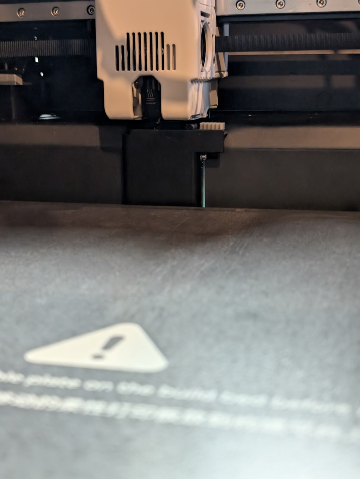
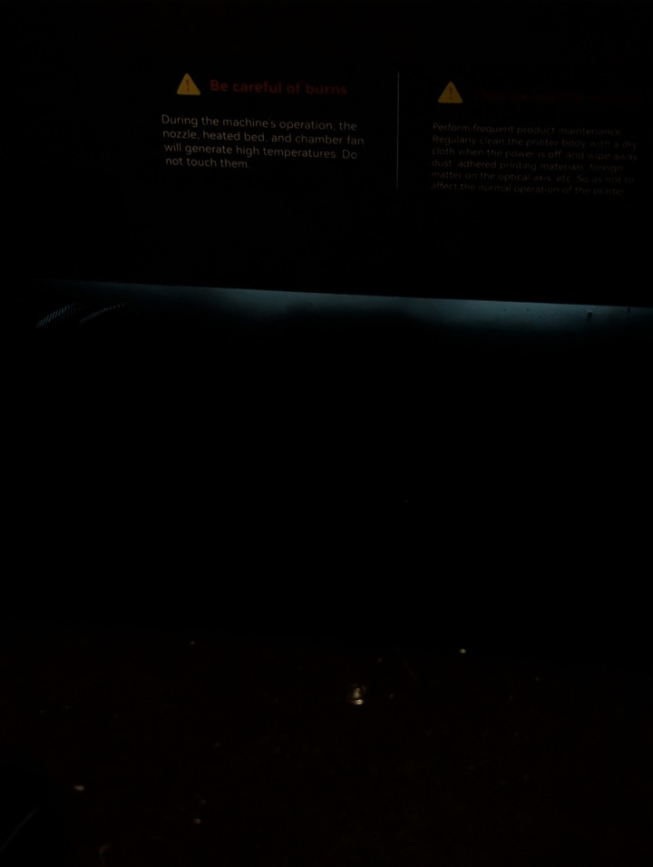

# Chamber Air Leaks

The Max 4 chamber is not mostly air tight. There are visible gaps and pass-throughs that let chamber air and heat escape, and the filament waste chute is essentially an open hole to the outside.

