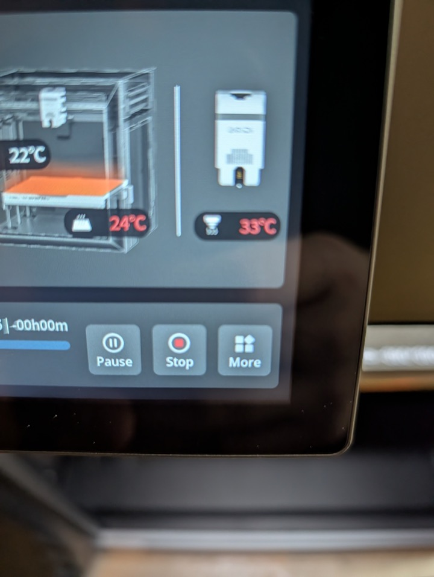
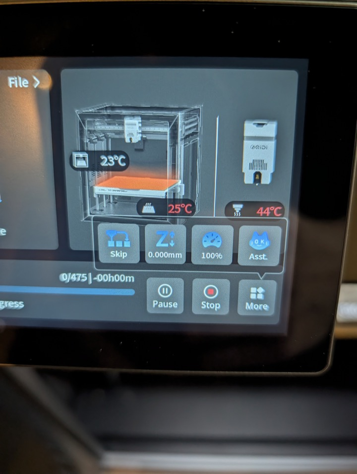
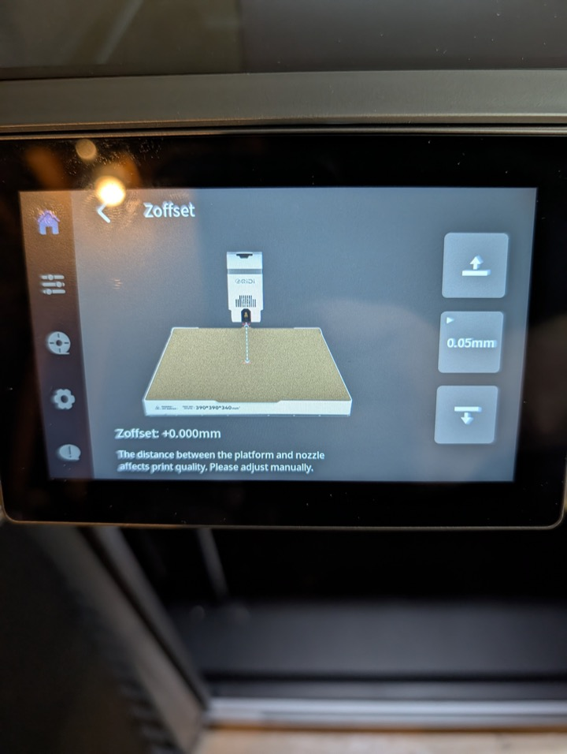

# Setting Z Offset

The easiest way to set your Z offset is while the printer is laying down the first layer. Open the `Z Offset` menu on the printer screen and make small adjustments while you watch the line go down. That lets you tune it against a real print instead of guessing.

If you are not sure where that menu is, this is the path on the printer screen while a print is running:

Tap `More` from the print screen.



Tap the blue `Z` button.



That opens the `Zoffset` adjustment screen.



When you change it that way, the printer should write the value to `saved_variables.cfg`.

At the end of the print, or right away if you already know the value you want, open `saved_variables.cfg` and make sure it contains a line like this:

```ini
z_offset = 0.01
```

Use whatever value is correct for your machine.

> [!CAUTION]
> 🚨 **SAVE CONFIG AND RESTART** in Fluidd, or use whatever restart method you prefer. 🚨
> 
> This is extremely important. If you do not save the config and restart, do not assume the printer kept your new Z offset.
> This is the cause of MANY PEOPLE complaining that the printer won't keep their Z offset.
