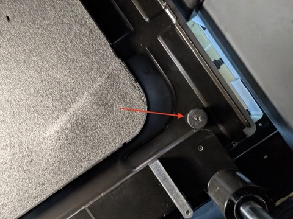
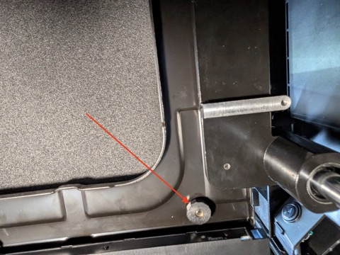
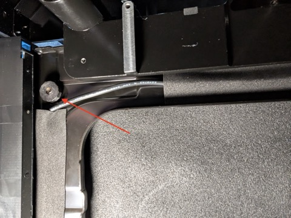
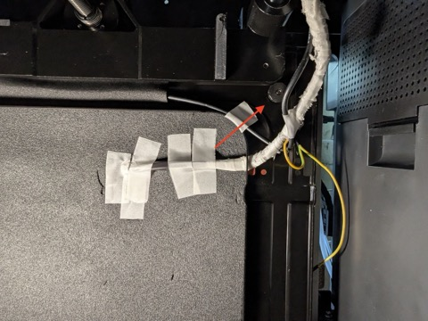
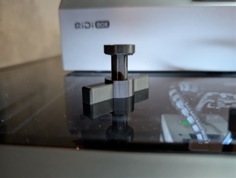
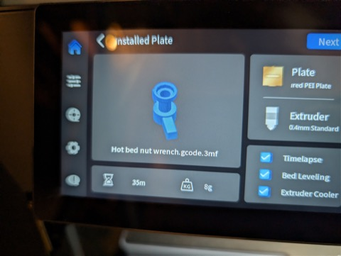

# Heated Bed Screws

The heated bed is mounted to a square frame. That frame is mounted to carriages on either side.

To adjust the bed, loosen or tighten the nuts on the four corner screws holding the heated bed to the frame. There are springs between the frame and the heated bed that apply upward force, and the nuts on those screws may be difficult to turn by hand.

Qidi includes a `Hot bed nut wrench` model in the files on the printer. Print that wrench to help turn the nuts.

You can also push down on the corner of the bed where you are adjusting the nut. This removes the tension being applied between the screw head and the nut underneath.
