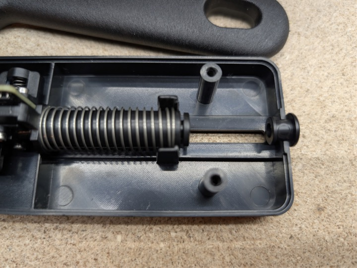
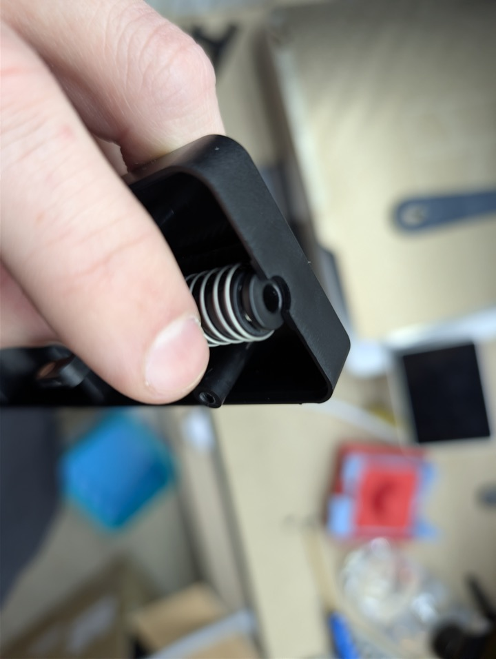
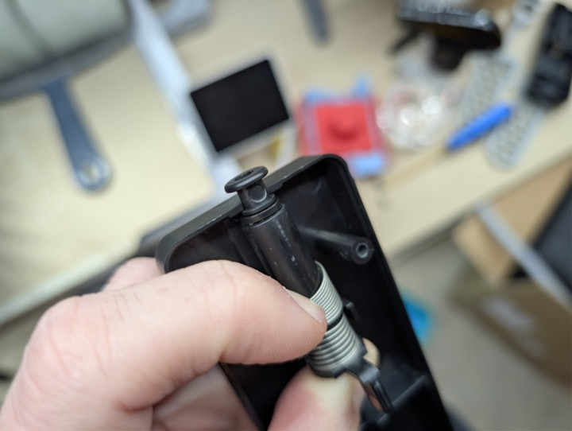

# Max 4 Qidi Box Hub

The Max 4 Qidi Box hub appears to be specific to the Max 4.  It differs in both form and function from the Plus 4 and Q2 variants (and likely the Q2C if that ends up being its own variant).  This is very confusing from Qidi that there are different hubs for every printer, but it's true.  A LOT of people out there are under the impression they're the same, PLEASE BE CAREFUL about who you talk to and who you believe about this.  Even Qidi's own official discord `#qidi-box` channel may not know all of this information, as it is extremely confusing why Qidi would do this.

## How does it work?
The hub contains a filament presence sensor and a hall effect sensor.  When the filament first enters the hub, it trips the presence sensor.  It then continues into the buffer all the way to the toolhead.  The box then pushes more filament and puts the buffer into tension (magnet not over the sensor).  The box ONLY FEEDS when the magnet is back over the sensor.  This is the source of MUCH confusion with Q2 owners because their box extruders sync with the toolhead extruder.  The Max 4 doesn't do that.

> But I'm really smart and I don't believe you.  I heard from some other dude that it does work that way.  Can you prove it?

**YES**

Here's [a video](https://drive.google.com/file/d/1LxAFlh_k44mWDEgMa9Q6DRMICQRtRUGh/view?usp=sharing) proving that the box **WILL NOT FEED** unless the buffer magnet passes over the sensor.

## Why is it hell to get the output PTFE tube disconencted?
There are two different things you need to compress to release the PTFE tube.  There's an inner collet that is actually latched on to your PTFE tube.  Then there's a collet extension or "outer collet" that the PTFE tube passes through.  The PTFE tube does not lock to that outer collet/ring.  Here's an image showing you exactly what's happening:

You must push the buffer up all the way and hold it there while pushing down on the outer collect/ring (to compress the inner collet), while also removing the PTFE tube.  This is much easier if you hold the buffer up as far as it will go with a small screw driver inserted under the plastic piece you would normally push up with your finger.

## Photos

The photos below show the hub internals from several angles.

Send this next image to Q2 owners that give you crap for not being able to easily remove the outlet PTFE tube and watch their minds explode.  This is with the outer collet/ring removed.

This is with the outer collet/ring put back in.

