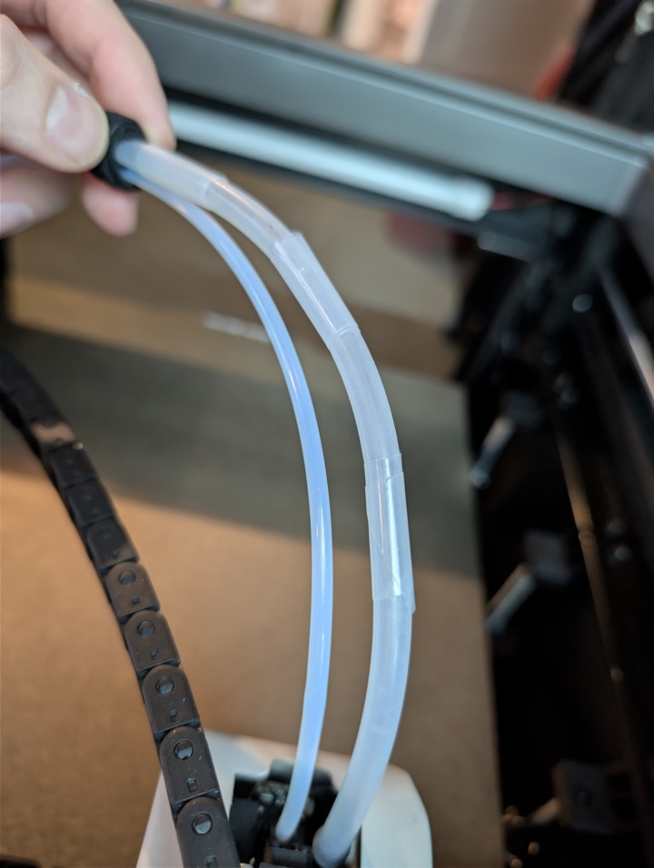

# Polar Cooler Drain

## Get More Air

The air coming out of the polar cooler is split 50/50 between the supply and drain lines.  You will get MUCH more air going into the toolhead if you use a [little pressure regulator](https://www.amazon.com/dp/B0DJJ91GC8) partially closed off on your drain line.

## Stand

If you want a stand and somewhere to collect potential condensate water, [this is a nice model](https://www.printables.com/model/1635623-qidi-polar-cooler-stand-w-drainage-bin)!

## Tubing Rubs on Glass

The silicone tubing that runs to the toolhead doesn't have the greatest path to get there.  It sits above the cable chain towards the toolhead, which makes it suseptible to rubbing on the top glass.  Qidi provides two cable ties that they instruct you to wrap around the tube on the highest points to keep this from happening, but there's a better way.  Get yourself some splippery tape and wrap it around a few different sections of the tubing and it'll work much better than the cable ties.  Something [like this](https://www.amazon.com/dp/B082VHZZNT).  You want it to be relatively thin, lots of UHMW tapes are on the thicker side.  The one linked is good.

