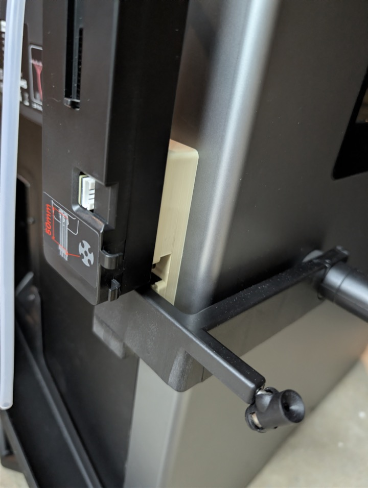
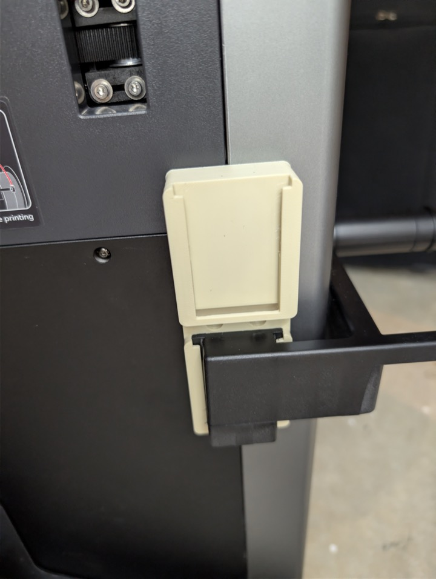

# Qidi Box Hub and External Spool Holder Adapter

If you want to use the Qidi Box hub and the external spool holder at the same time, this adapter does the job:

[Mount the Qidi Box hub and filament spool holder at the same time](https://makerworld.com/en/models/2222919-qidi-q2-double-mount-for-box-and-ext-spool)

