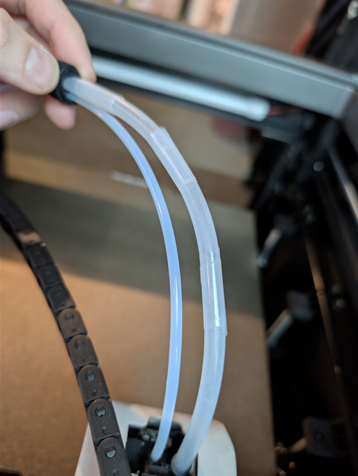

# Polar Cooler

## Specs

- Stock tubing measures roughly 4.5 mm inner diameter and 7.5 mm outer diameter. Treat those numbers as approximate rather than exact because the tubing is very soft and can measure differently depending on how it is handled.
- The stock plumbing splits air between the supply line to the toolhead and the drain line.

## Console and GCode Control

The polar cooler is exposed in Qidi's config as `Polar_cooler` on `M106 P4`.

- `M106 P4 S255` turns it on. Any non-zero `S` value turns it on.
- `SET_PIN PIN=Polar_cooler VALUE=1` turns it on.
- `SET_PIN PIN=Polar_cooler VALUE=0` turns it off.

See [Fan Assignments](./fan_assignments.md) for the full fan and output mapping.

## Mods

### Get More Air

The air coming out of the polar cooler is split 50/50 between the supply and drain lines. You will get much more air going into the toolhead if you use a [small pressure regulator](https://www.amazon.com/dp/B0DJJ91GC8) partially closed off on the drain line.

### Stand

If you want a stand and somewhere to collect potential condensate water, [this is a nice model](https://www.printables.com/model/1635623-qidi-polar-cooler-stand-w-drainage-bin).

### Tubing Rubs on Glass

The silicone tubing that runs to the toolhead does not have the greatest path to get there. It sits above the cable chain toward the toolhead, which makes it susceptible to rubbing on the top glass. Qidi provides two cable ties that they instruct you to wrap around the tube on the highest points to keep this from happening, but a slick tape wrap works better. Something [like this](https://www.amazon.com/dp/B082VHZZNT) works well. You want it to be relatively thin; a lot of UHMW tapes are on the thicker side.

If you want a printed routing solution instead, there are also cable chain clip options:

- [Cable chain clip for the Polar Cooler tube and PTFE tube](https://www.printables.com/model/1645027-qidi-max-4-polar-cooler-schlauchfuhrung-oben-und-s)
- [Cable chain clip for the Polar Cooler tube only](https://www.printables.com/model/1645032-qidi-max-4-polar-cooler-schlauchfuhrung-seitlich)

