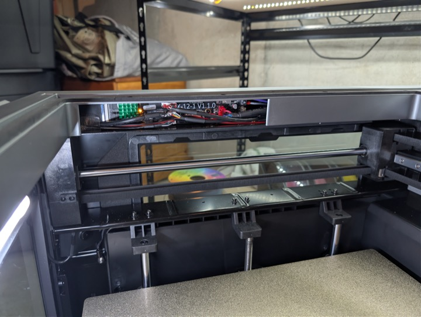
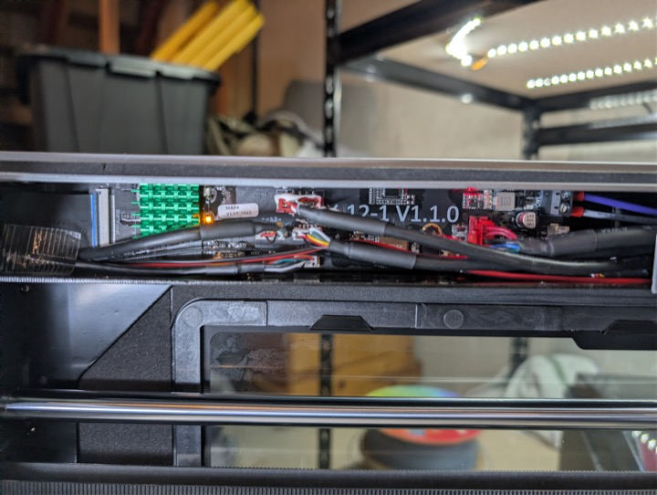
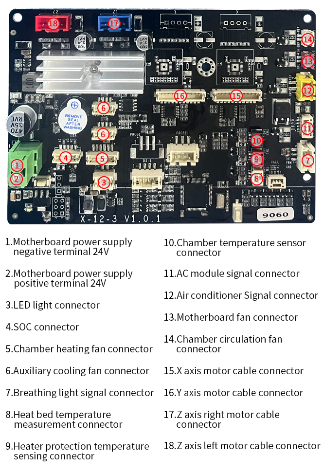
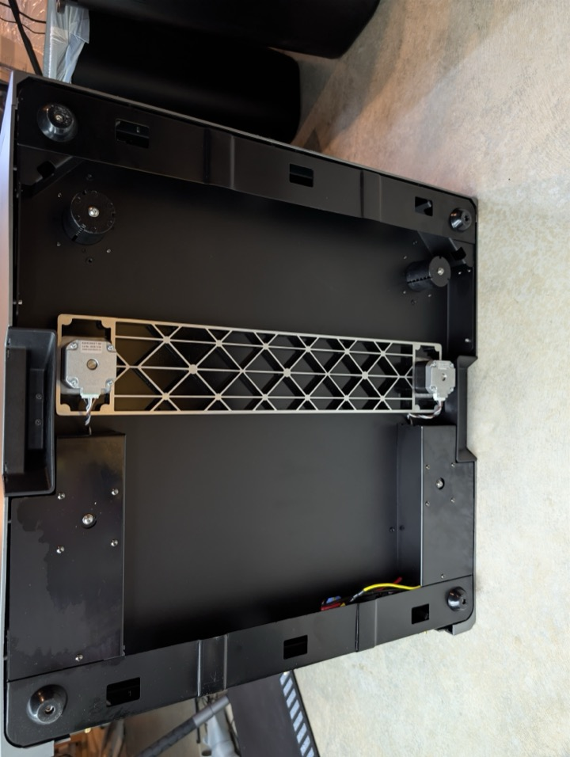
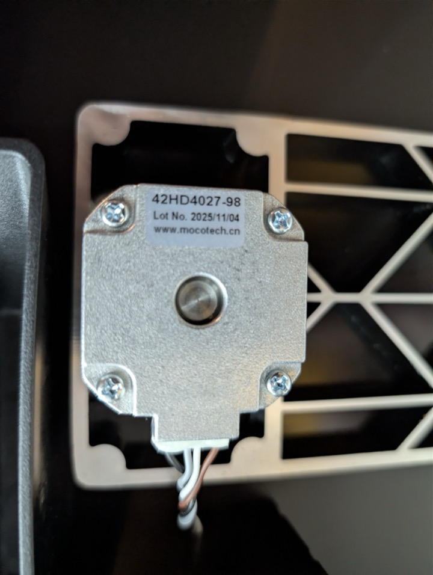

# Internal components
### AP Board

The AP board is located in the top left of the printer and can be accessed by removing two screws on the top and bottom of the plastic trim.  You do not need to remove anything else to access it, but it is cramped inside.

### Chamber Heat and Exhaust Fans

Fans for the chamber exhaust and the chamber heater are the same.
* Brand: [www.qx-cn.com](http://www.qx-cn.com)
* Model: QX12032B
* Power: DC 24V .5A

### Motherboard Fan

* Brand: [www.qx-cn.com](http://www.qx-cn.com)
* Model: QX8025M24B
* Power: DC 24V 0.25A

### Motherboard "Schematic"

A previously posted version of this motherboard schematic on Qidi's wiki had the X and Y connectors flipped.  This is the latest version as of March 9th, 2026.

### Power Supply

* Brand: [www.czchenglian.com](https://www.czchenglian.com)
* Model: CZL-150D-24E
* Input: 100-240V 3.4A Max
* Output: 24V 6.5A

### Relay Switching Board (SSR)

* H-4 V1.2.0
* Incoming power connections order (left to right):
    * Yellow (ground)
    * Black
    * Red
* Output connections to chamber heater (top to bottom):
    * Blue
    * Red
* Output connections to heated bed (left to right):
    * Black
    * Blue
    * Red

### Z Steppers

The Z axis steppers are located on the underside of the machine.
* Model: 42HD4027-98
* Brand: [www.mocotech.cn](http://www.mocotech.cn)
