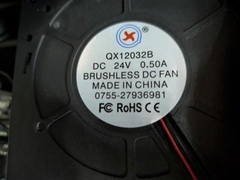
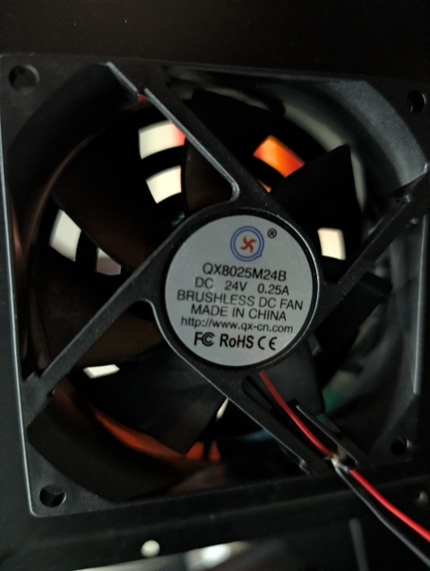
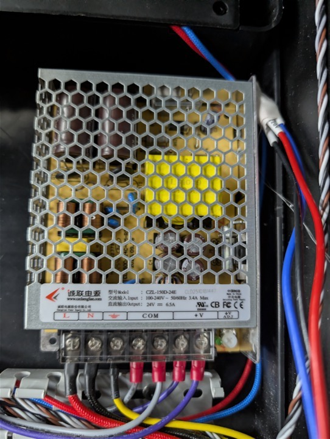
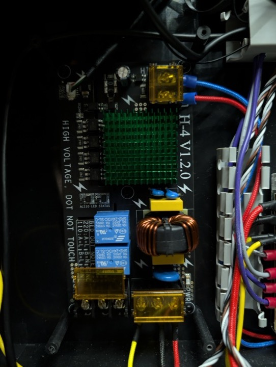

# Internal components
### Chamber Heat and Exhaust Fans

Fans for the chamber exhaust and the chamber heater are the same.
* Brand: [www.qx-cn.com](http://www.qx-cn.com)
* Model: QX12032B
* Power: DC 24V .5A

### Motherboard Fan

* Brand: [www.qx-cn.com](http://www.qx-cn.com)
* Model: QX8025M24B
* Power: DC 24V 0.25A

### Power Supply

* Brand: [www.czchenglian.com](https://www.czchenglian.com)
* Model: CZL-150D-24E
* Input: 100-240V 3.4A Max
* Output: 24V 6.5A

### Relay Switching Board (SSR)

* H-4 V1.2.0
* Incoming power connections order (left to right):
    * Yellow (ground)
    * Black
    * Red
* Output connections to chamber heater (top to bottom):
    * Blue
    * Red
* Output connections to heated bed (left to right):
    * Black
    * Red
    * Blue
